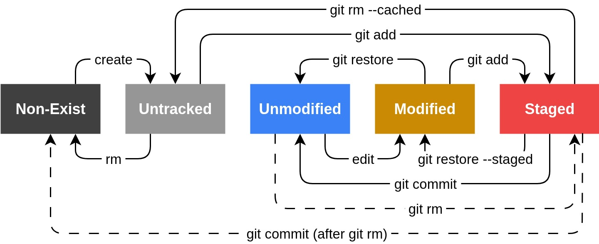

# Git Notes

## Resources
- [x] [Book - Pro Git](https://git-scm.com/book/en/v2)

# Get Started
- If SSH key has password, before first-time pushing and pulling, run `eval "$(ssh-agent)"` and `ssh-add <private-key-path>`. Later actions can simple use user input passwords.
- Configuration
  	- `git config --global user.name "<commit-name>"`
  	- `git config --global user.email "<commit-email>"`
  	- On Windows: `git config --global core.autocrlf false`

# Conflict Resolve
If commits are diverged on remote and local
1. `git fetch <origin>`
2. `git merge origin/main`
3. If commits are on the same files, then manually fix and remove the git comments, then `git add .` and `git commit`.

# Git File Life Cycle

